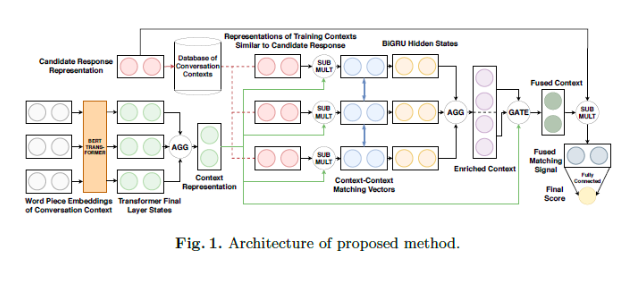
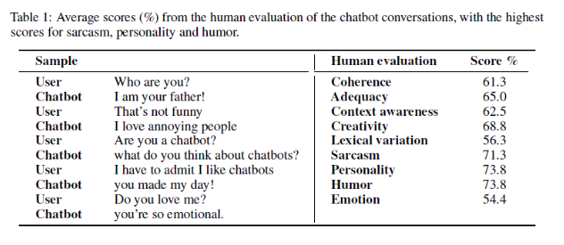
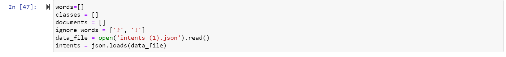
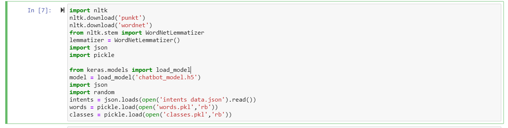
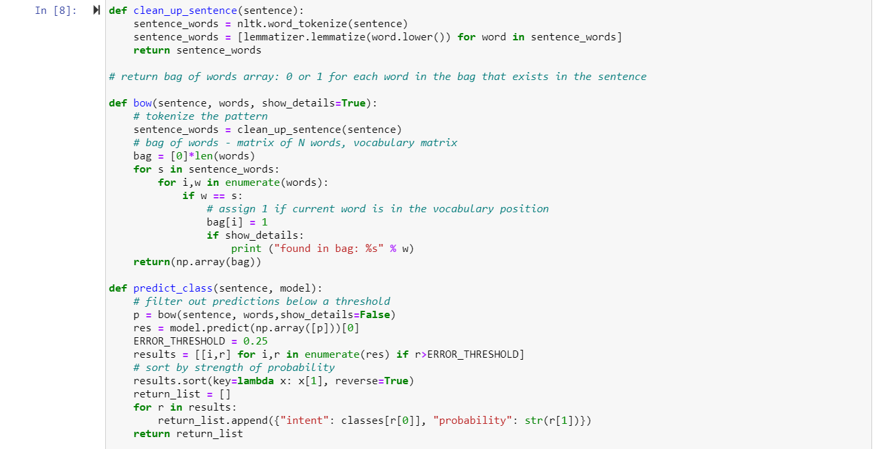
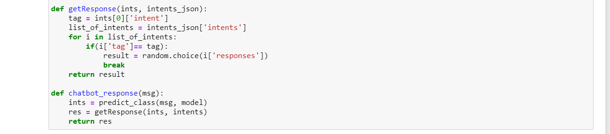
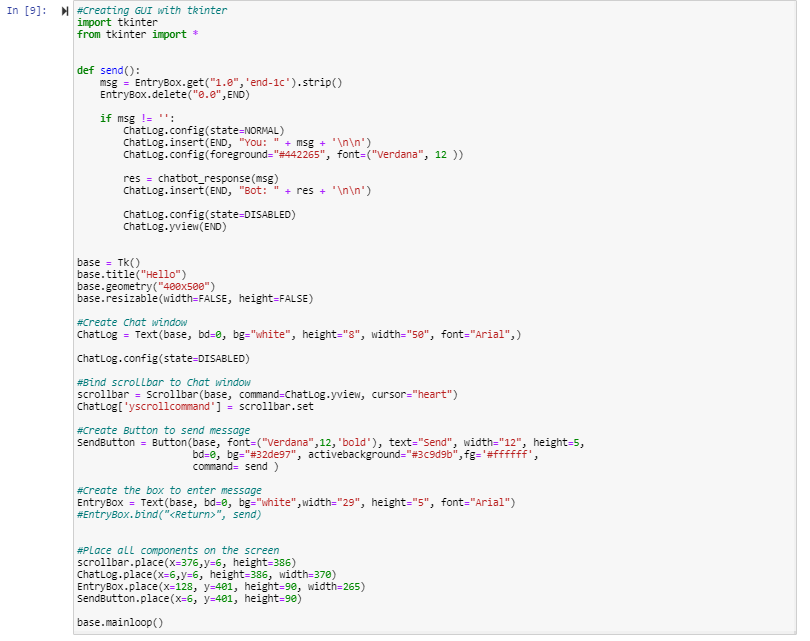

# Building a Chatbot using NLP
## Introduction:
In today's world, most businesses rely on customer service, Providing customer support can be through phone or through chat by using the chatbot. We can easily provide the basic or repeated solutions that were asked by customers without any human intervention which is time and cost-saving for businesses. Most of the customers in today's world prefer to contact through messages rather than calling and being on wait for a longer time.
Gartner forecasts that 85% of customer service communications will be handled by chatbots by 2020, they currently manage about 30 percent of transactions currently. It is now increasingly common to use artificial neural networks to build chatbots, but teaching a machine to have natural conversations is very difficult and often involves broad and complicated language models. With all the updates and improvements in TensorFlow 2.0, we can easily construct complex models.
## Statement of the Problem:
So what is a chatbot?
A chatbot is a piece of software operated by artificial intelligence on a smartphone (Siri, Alexa, Google Assistant, etc.), application, website, or other networks that attempt to measure the needs of customers and then assist them to perform a specific task such as a business transaction, hotel booking, form submission, etc. Nearly every organization today has a chatbot deployed to communicate with customers. Some of the ways organizations use chatbots are: 
- To answer questions about flights 
- Connecting consumers and their investments 
- As service for customers
On a number of predefined problems specific to the domain on which it is based, chatbots offer any real live chat assistance. This adapts the basic human language and meets up in a change in position with humans. Chatbots are specially designed to make it simple and safe to communicate between machines and humans.

## Review of Literature:
Studies on retrieval-based chatbots can be split into Cross-encoders that fit word throughout the pair, like many of the sequence pair matching jobs, and Bi-encoders that encrypt the pair independently. It tends to have greater performance, but as candidate responses can not be encoded offline, it is also much slower. For a while now, pre-trained multi-layer transformer frameworks were used as language templates to significantly impact a range of activities for natural language processing and information retrieval.  It has been shown that such language models are being used to build bi-encoders with a somewhat faster approximation rate in text-matching contexts, that execute nearly along with cross-encoders. This paper builds on this work by designing a sequence-based architecture that takes meaning into consideration during lessons.[Amir Vakili and Azadeh Shakery](https://arxiv.org/pdf/1911.02290.pdf).

A detailed learning dialogue, cynical and humorous replies from a conversation design viewpoint, are generated by this ai chatbot research paper[Suzana Ilic, Reiichiro Nakano](https://arxiv.org/pdf/1909.09531.pdf). In a sophisticated curated data packet of 3000 interview-answering pairs, the authors implemented a seq2seq model which is the heart of our cynical medium chat. The study then shows that end-to-end systems are able to rapidly learn trends from limited databases, thereby moving basic linguistic constructs describing abstract principles to unexplored environments. The browser also has an LSTM-based encoder-decoder model, where users can communicate with the chatbot directly. Language content, imagination, and human features have been assessed and the capabilities, weaknesses, and potential of the method are revealed for future study.

## Objectives of the Study:
My main objective for this project is to establish a chatbot system for the UNT  data science department that makes it easier for students to get answers for their course-related questions and some basic information about the department. It will answer questions like “where to take an appointment for an academic advisor”? and “what are the general electives available for masters students ”? etc. 
                                         Based on how they are designed, there are two main types of chatbot models; Retrieval based and Generative based models. Predefined input patterns and responses are used by a retrieval-based chatbot. To pick the acceptable response, it then uses some kind of proposed methodology. In the market, it is commonly used to build goal-oriented chatbots where we can change the chatbot's style and function to drive our consumers with the best experience. The generative models aren't really built on any predefined answers. They are predicated on neural networks, seq 2 seq. That is the same definition as a translation by computer. 

  I will use python and machine learning algorithms to build bot. The chatbot is trained using deep learning techniques with few datasets that contain patterns, categories, and responses. This is also called a retrieval based bot. Initially, I will Import necessary packages for data loading and then preprocess data like word tokenization and lemmatization next will create training and test data, training data is the one which we use to provide inputs and output patterns for bot once the training data is ready will build a deep neural network model and then run it for different responses and check the chatbot.
## Libraries:
‘Intents data.json’ is the file which we use for this project where it contains patterns and responses.
-classes.pkl - it is a file which contains a list with different types of classes of responses.
-words.pkl - this file is used for pattern recognition and it contains lists of different words.
-chatbot.py - this data file contains the python code for the project.
-chatbot_model.h5 -  created model from trained model.
NLTK- Natural Language Toolkit which is a major forum for developing python programs to work with human language data. Additionally, libraries for text processing such as classification, stemming, semantic reasoning, tokenization, tagging, parsing, wrappers etc. It also facilitates free interfaces for over 50 businesses and lexical tools such as WordNet.
## Building the Bot:
1. Import and load the data file
2. Preprocess data
3. Creating the Deep Learning Model.
4. Predict the response
5. Creating GUI for chatbot.

### 1. Import and load the data file:
Firstly, we have to import the required libraries such as NLTK, pickle, numpy, tensorflow and keras. Then parse the json file into python by importing JSON library.

From the below screenshot, we can see how the ‘intents data.json’ file looks like. So we can see the intents, patterns and responses here in the data file.

### 2. Pre-processing the data:
Since the data is a text one, so we need to pre-process the data before creating a model. This process we can do by tokenizing and lemmatizing the words in the data. Tokenizing is the method by which the entire document is divided into small sections, such as phrases. For that we use nltk.word_tokenize(). We create a nested for loop and build a list of classes for our tags.

After that the list of words will be taken and then will lemmatize. Lemmatize means to translate a word into a base meaning. For Example, Jumped- Jump. The goal of doing this is to narrow down anything into base level so that when we finally process these terms for machine learning, it will save us a lot of time and needless mistakes. This is somewhat similar to stemming, which is to reduce down to its base or root form an inflected term.
.PNG)
### 3. Creating the Deep Learning Model:

First, We create training data by giving input and output. The patterns will be our input and the output shall be the class to which our input pattern refers. The machine doesn't understand text, however, so we're going to translate text into numbers.

With the help of training data we created a 3-layer neural network. For that keras sequential API is used. In reality, one of the simplest neural networks, a multi-layer perceptron, is the Sequential model in Keras. This network has 3 layers, with 128 neurons in the first, 64 neurons in the second, the number of intents within that last as the number of neurons. After training the model, the whole thing is changed to a numpy array and restored as ‘chatbot_model.h5’.
### 4. Predict the Response:

We are going to load the trained model and then use a graphical user interface that predicts the bot's reaction. The model can only inform us the class to which it belongs, so we can execute those functions that will define the class and then extract a random response from the answer list.
With the help of clean_up_sentence() function all the input sentences are cleaned up. Then bow() function is used to create a bag of words for forecasting the classes. Next, as you can see in the picture the error threshold is 0.25 which is to avoid too much overfitting.  The getResponse() function takes the output list and scans the json file and produces the maximum likelihood of most answers. 

Ultimately, chatbot_response() collects the message which is entered by the user and predicts the class using predict_class() function. Then the answer is given back to the user with the help of getResponse(). Now we can ask bot anything and it responds back.

### 5. Creating GUI Using Tkinter:
With the help of  Tkinter library in python we can create GUI for chatbot. By using this we create buttons such as send button which is a basic functionality. And also we built scrollbar, chat window and textbox for creating messages by adjusting the components like coordinates and heights.

##  Result:

## Conclusion:
At last a chabot is created using a deep learning model and NLP. The data can be modified according to business requirements. So as I already explained how chatbots are changing the communication world in IT industries. With the help of different data we can get accurate responses from chatbot.
## Bibliography:
